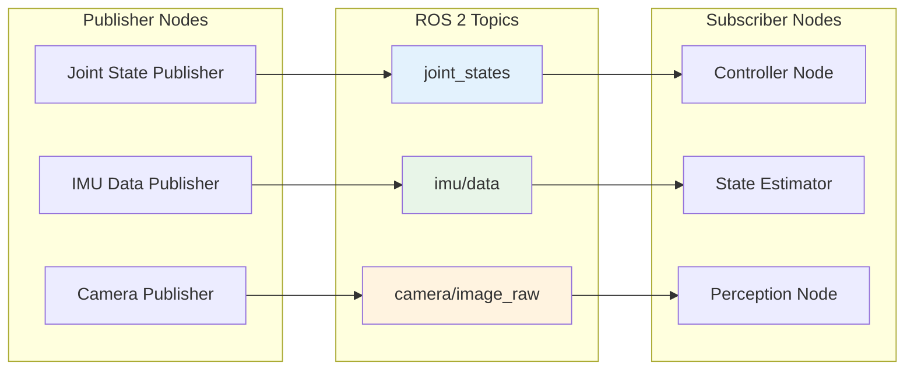
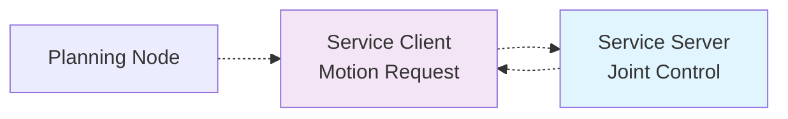
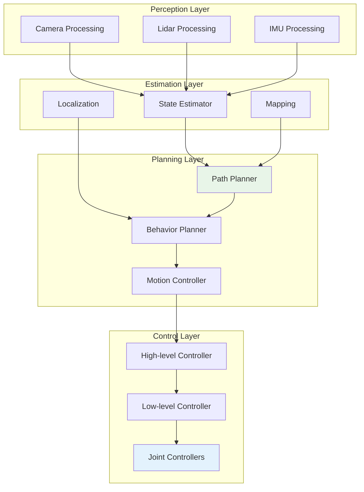

# Communication Diagram: Humanoid Robot Control Cycle

## Overview

This diagram illustrates the communication patterns in a humanoid robot control system, showing how different components interact through ROS 2 topics, services, and parameters.

## System Architecture

```mermaid
graph TB
    subgraph "Humanoid Robot"
        A[Physical Robot]
        B[Actuators]
        C[Sensors]
    end

    subgraph "ROS 2 Middleware"
        DDS[DDS - Data Distribution Service]
    end

    subgraph "Control System Nodes"
        D[Sensor Processing Node]
        E[State Estimation Node]
        F[Path Planning Node]
        G[Controller Node]
        H[Joint Control Node]
        I[High-level Planner]
    end

    subgraph "External Systems"
        J[RViz Visualization]
        K[Command Interface]
        L[Logging System]
    end

    A --> B
    A --> C
    C --> D
    D --> DDS
    DDS --> E
    E --> F
    F --> G
    G --> H
    H --> B
    DDS --> J
    K --> DDS
    DDS --> L

    style A fill:#e1f5fe
    style DDS fill:#f3e5f5
    style J fill:#e8f5e8
    style K fill:#fff3e0
    style L fill:#fce4ec
</>

## Communication Flow

```mermaid
sequenceDiagram
    participant S as Sensors
    participant SP as Sensor Processing
    participant SE as State Estimation
    participant PP as Path Planning
    participant C as Controller
    participant JC as Joint Control
    participant A as Actuators

    S->>SP: Raw sensor data (topics)
    SP->>SE: Processed sensor data (topics)
    SE->>PP: Robot state (topics)
    PP->>C: Desired trajectory (topics)
    C->>JC: Control commands (topics)
    JC->>A: Actuator commands
    A-->>S: Feedback loop
```

## Topic Communication Pattern



## Service Communication Pattern



## Detailed Control Cycle



## QoS Profile Recommendations

For different communication patterns in humanoid robotics:

- **Joint States**: BEST_EFFORT, KEEP_LAST(5) - Some data loss acceptable for real-time control
- **Sensor Data**: RELIABLE, KEEP_LAST(10) - Critical for safety and control
- **Control Commands**: RELIABLE, KEEP_LAST(1) - Must be delivered for safety
- **Emergency Commands**: RELIABLE, KEEP_LAST(1) - Critical for safety systems
- **Logging**: RELIABLE, KEEP_ALL - For debugging and analysis

## Key Communication Principles

1. **Decoupling**: Publishers and subscribers don't need to know about each other
2. **Real-time**: QoS profiles ensure timing requirements are met
3. **Scalability**: New nodes can subscribe to topics without changing existing code
4. **Safety**: Critical commands use reliable delivery with appropriate timeouts
5. **Modularity**: Each node has a clear responsibility in the communication flow