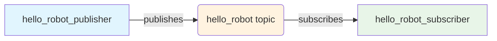
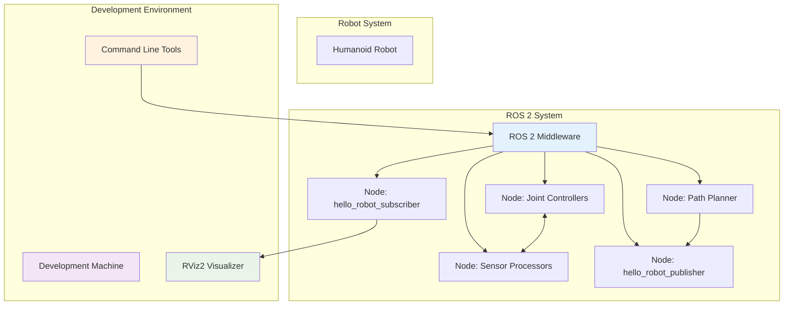
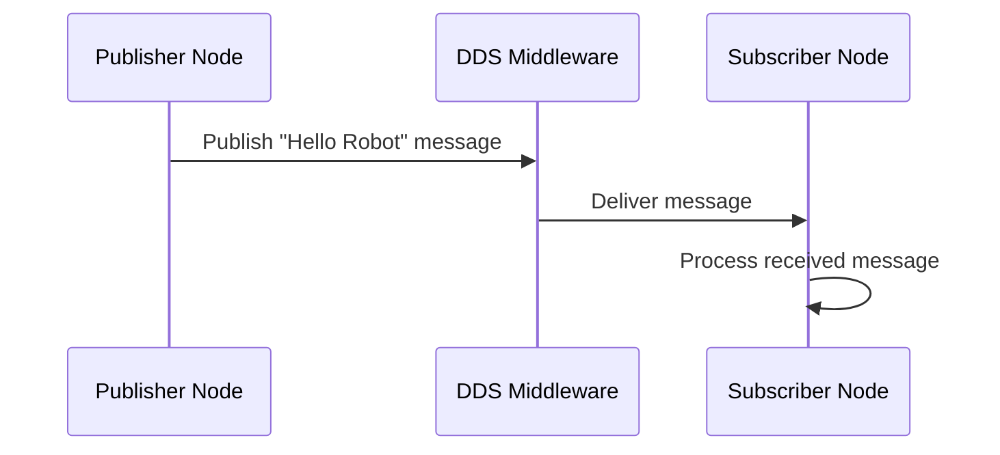

# ROS 2 Workspace Diagram

## Directory Structure Diagram

```
~/ros2_ws/ (workspace root)
├── src/ (source code)
│   ├── hello_robot_pkg/
│   │   ├── hello_robot_publisher.py
│   │   └── hello_robot_subscriber.py
│   ├── utilities.py
│   ├── config_manager.py
│   └── (other packages...)
├── build/ (build artifacts)
│   ├── hello_robot_pkg/
│   └── (build files...)
├── install/ (installed packages)
│   ├── lib/
│   ├── share/
│   └── (installed files...)
└── log/ (log files)
    ├── latest/
    └── (log files...)
```

## Node Communication Diagram



## System Architecture Diagram



## Communication Flow Diagram



## Package Organization

The workspace is organized with a modular approach:

- **Core Packages**: Basic robot functionality (communication, basic control)
- **Sensor Packages**: Sensor data processing and integration
- **Control Packages**: Joint controllers and motion planning
- **Utility Packages**: Common utilities and configuration management
- **Demo Packages**: Examples and tutorials (like hello_robot_pkg)

This structure allows for scalable development where each component can be developed, tested, and maintained independently while maintaining clear communication interfaces through ROS 2 topics, services, and actions.