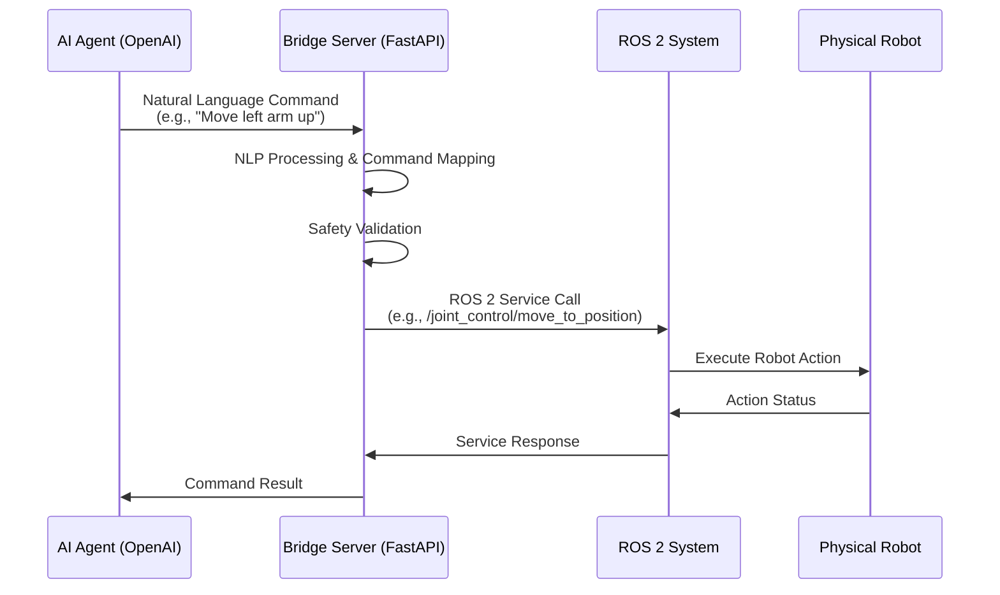

# AI to ROS 2 Action Execution Flow

This diagram shows the flow of actions from AI agents to ROS 2 service calls through the bridge server.

## Detailed Flow Description

1. **AI Agent**: Sends natural language commands via OpenAI's function calling API
2. **Bridge Server**:
   - Receives the command through `/translate-command` or `/function-call` endpoints
   - Performs NLP processing to understand the command intent
   - Maps to appropriate ROS 2 service calls
   - Validates safety constraints
3. **ROS 2 System**: Executes the actual robot control services
4. **Physical Robot**: Performs the requested action
5. **Response Flow**: Status flows back through the same chain to the AI agent

## Safety Validation Points

- Joint position limits validation
- Velocity constraints validation
- Robot state validation (enabled/disabled)
- Emergency stop checks
- Multi-joint coordination validation

## Error Handling

- Invalid commands are logged and rejected
- Safety violations trigger safety protocols
- Service call failures are reported back to AI agent